# Usage Instructions

## General Instructions for Both Usage Streams

1) Navigate to this directory

2) Create and activate environment
```bash
conda create -n Xiaomi-Monitor python=3.10 -y
conda activate Xiaomi-Monitor
```

3) Navigate to the root directory and install dependencies
```bash
pip install -r requirements.txt
```

4) Identify the `example.env` file in the repository and name it `.env` without extension.

5) Fill in the `MI_CHARACTERISTIC` field.

- Optionally, fill `SOCKET_HOST` and `SOCKET_PORT` fields for Socket data transmission.
- Optionally, fill `WEBSOCKET_HOST` and `WEBSOCKET_PORT` fields WebSocket data transmission.

## Command-Line Interface (CLI)

1) Run the service
```bash
cd src
python cli.py

# Example usage
python cli.py -t 5 -o data -v

# Example usage for API options
python cli.py -api --api-url http://localhost:6123

# Example usage for Socket options
python cli.py -s -sh 127.0.0.1 -sp 55555
```

| Flag   | Long Form            | Type           | Default            | Description                                                                           |
| ------ | ---------------- | -------------- | ------------------ | ------------------------------------------------------------------------------------- |
| `-t`   | `--scan-timeout`     | `float`        | `10.0`             | Duration (in seconds) for each BLE scan.                                  |
| `-mac` | `--mac-address`      | `str`          | *None*             | Optional MAC address of the BLE device to connect directly (enables end-to-end service). |
| `-o`   | `--output-file`      | `str`          | `"monitor_data"`   | Name of the CSV file for storing logged data.                                  |
| `-m`   | `--file-mode`        | `"w"` or `"a"` | `"w"`              | Choose whether to **write** a new file (`w`) or **append** to an existing file (`a`).  |
| `-v`   | `--verbose`          | `bool`         | `False`            | Enable live data logging output in the terminal.                              |
| `-api` | `--enable-api`       | `bool`         | `False`            | Enable API server for data transmission.                          |
| *None* | `--api-url`          | `str`          | *None*             | IP address (host) of the API server.                                |
| `-s`   | `--enable-socket`    | `bool`         | `False`            | Enable Socket server for data transmission.                          |
| `-th`  | `--tcp-host`         | `str`          | *None*             | Host IP address of the Socket server.                                |
| `-tp`  | `--tcp-port`         | `int`          | *None*             | Host port number of the Socket server.                                |
| `-ws`  | `--enable-websocket` | `bool`         | `False`            | Enable WebSocket server for real-time data transmission.                          |
| `-wsh` | `--ws-host`          | `str`          | *None*             | Host IP address of the WebSocket server.                                |
| `-wsp` | `--ws-port`          | `int`          | *None*             | Port number of the WebSocket server.                                |
| `-i`   | `--interval`         | `int`          | *None*             | Interval (in seconds) between each data transmission (default is device minimum, ~6s).      |

2) Repeatedly scan (input 'r') until the `Mi Temperature and Humidity Monitor 2` (LYWSD03MMC) device is on the list of BLE devices and can be selected.

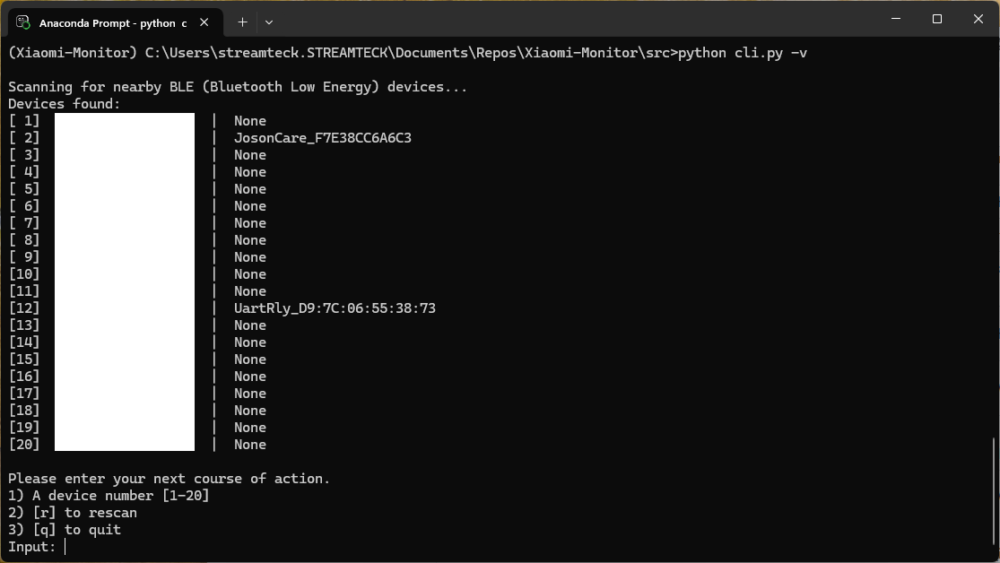

3) Repeatedly attempt to connect (input 'r' or just 'a' once) to the BLE device, ignoring the following errors (if program does not exit):
- `Could not get GATT services: Unreachable`
- `Device with address ##:##:##:##:##:## was not found.`
- A Blank Error

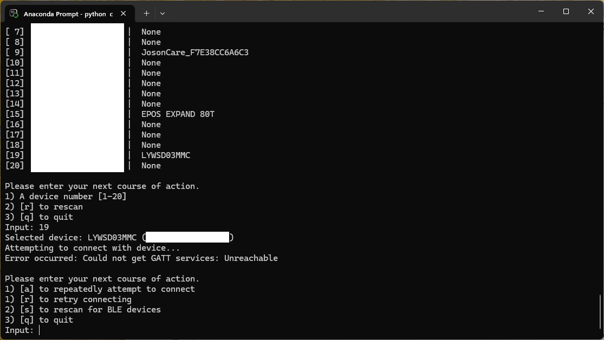

4) Check the contents of the output `.csv` file for updated data.

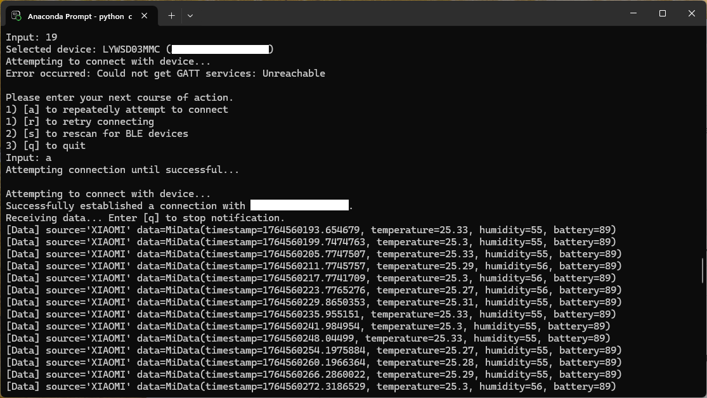

5) Terminate the program.

(Optional) Run the dummy API client to mock retrieve measurement data (if an API server was started in step 1)
```bash
python ./clients/api_client.py
```

(Optional) Run the dummy Socket client to mock retrieve measurement data (if a Socket server was started in step 1)
```bash
python ./clients/socket_client.py
```

(Optional) Run the dummy WebSocket client to mock retrieve measurement data (if a WebSocket server was started in step 1)
```bash
python ./clients/ws_client.py
```

## Graphical User Interface (GUI)

1) Run the service
```bash
cd src
python ui.py
```

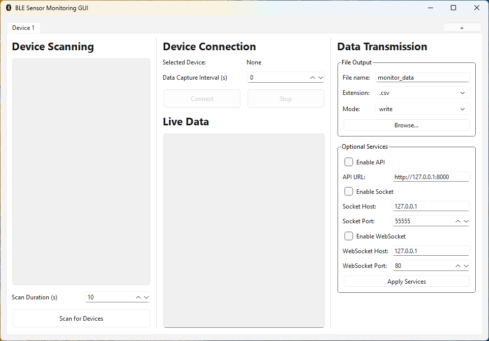

2) Set your desired scan duration per scan (in seconds) in the 'Scan Duration' field.

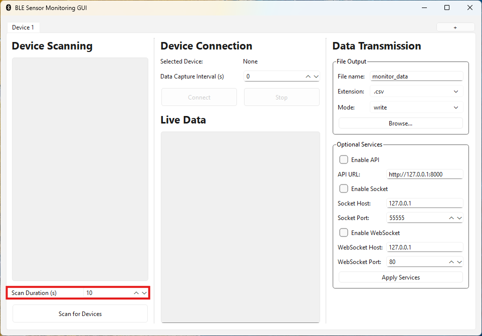

3) Repeatedly click the button labelled 'Scan for Devices' until the `Mi Temperature and Humidity Monitor 2` (LYWSD03MMC) device is on the list.

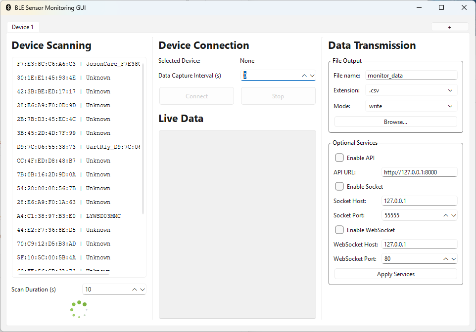

4) Double click the row of the LYWSD03MMC device within the BLE Devices list to select the device (Selection is reflected on the label in the top part of the middle section)

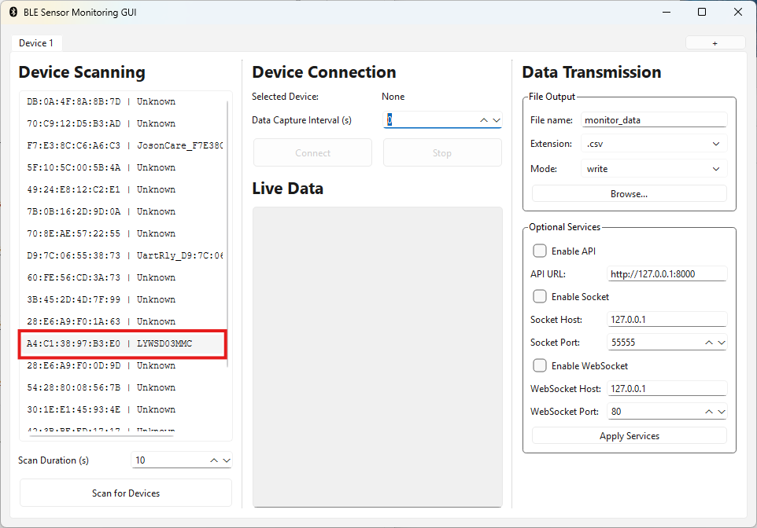

5) Set your desired data transmission period from 1 second to 604800 seconds (1 week) in the 'Data Capture Interval' field.

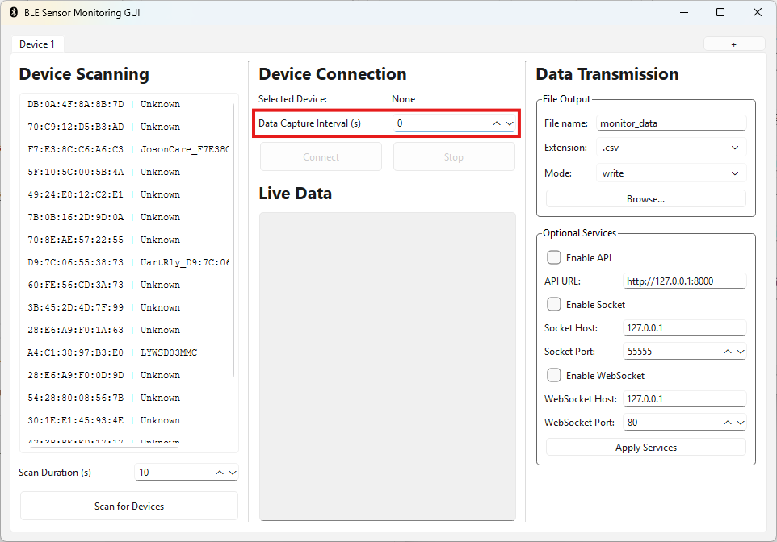

6) On the right side, set the desired file name and location for the output `.csv` file (This form autosaves as you edit). If no specific location is chosen through the button labelled 'Browse...', the same directory as the `ui.py` file will be used.

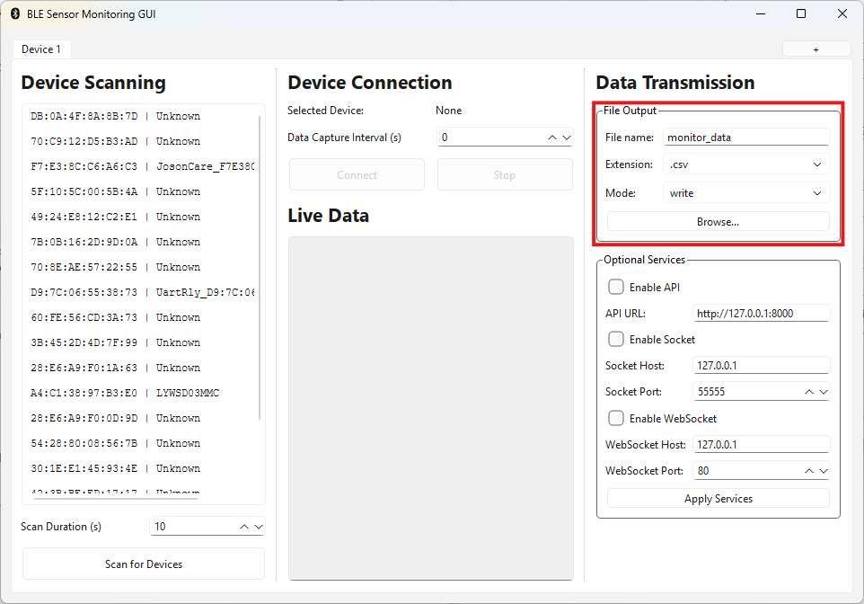

7) Repeatedly click the button labelled 'Connect' until the device has successfully connected, dismissing the following errors that pop up (if program does not exit):

- `Could not get GATT services: Unreachable`
- `Device with address ##:##:##:##:##:## was not found.`
- A Blank Error

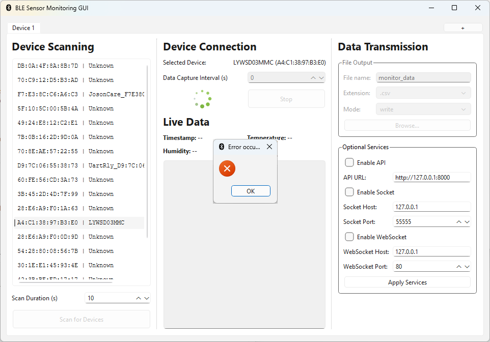

8) Check the contents of the data log and the selected output `.csv` file for updated data.

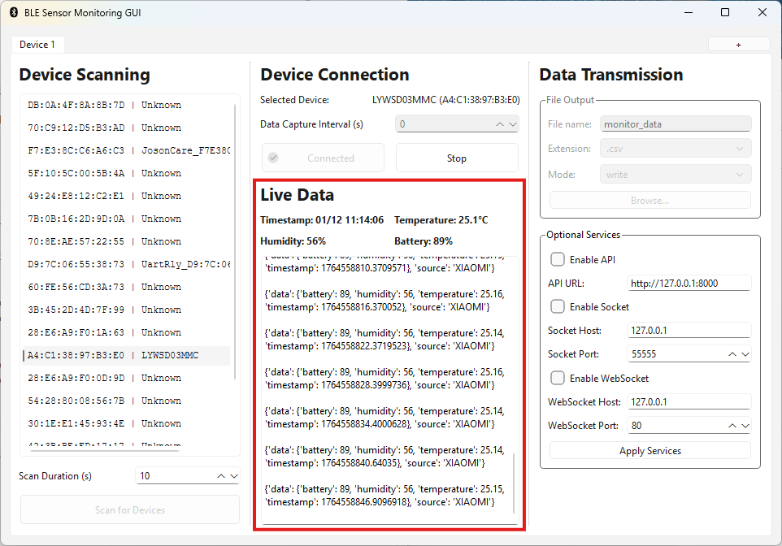

9) Terminate the program by clicking the exit button on the top right corner of the UI.

(Optional) To connect to and monitor multiple BLE devices from the same program UI, click the 'plus' button to add new tabs which can be used to connect to other BLE devices (Double click the tab header to rename).

(Optional) Select the checkbox to enable an API server and add the URL in the field below (A common default URL has been provided). Then click the button labelled 'Apply Services' to start the server, signified by a text in the data log.

(Optional) Select the checkbox to enable a Socket server and add the host and port in the fields below (Common default host and port have been provided). Then click the button labelled 'Apply Services' to start the server, signified by a text in the data log.

(Optional) Select the checkbox to enable a WebSocket server and add the host and port in the fields below (Common default host and port have been provided). Then click the button labelled 'Apply Services' to start the server, signified by a text in the data log.

To disconnect any optional services server, simply uncheck the checkbox and click the button labelled 'Apply Services' again.

# Program Compatiblity

This program supports the following BLE devices:

- Mi Temperature and Humidity Monitor 2 (`LYWSD03MMC`)
- Pulse Oximeter Model: PO2 (`O2Ring 8231`)